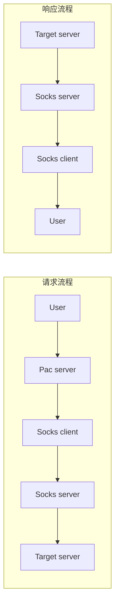
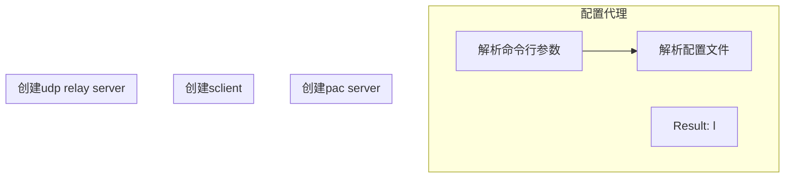

# 目录

<!-- prettier-ignore-start -->

<!-- @import "[TOC]" {cmd="toc" depthFrom=1 depthTo=6 orderedList=false} -->

<!-- code_chunk_output -->

* [目录](#目录)
* [整体设计](#整体设计)
* [socks client 设计](#socks-client-设计)
	* [握手阶段](#握手阶段)
	* [建立连接](#建立连接)
	* [传输阶段](#传输阶段)
* [socks server 设计](#socks-server-设计)

<!-- /code_chunk_output -->

<!-- prettier-ignore-end -->

# 整体设计

在本代理系统的设计中, 经典的 socks 代理被拆分成了两个独立的角色 socks-client 和 socks-server.
这两个角色共同完成 socks 代理的功能, 并且能够使用加密的自定义方式处理彼此之间的流量.

本代理系统中分为以下几种角色：

1. 用户(user) - 所有的 user agents 都属于这个范围, 例如: 浏览器, 手机等.
1. socks client(sclient) - 对用户来说, 它就像原始的 socks server 一样, 承担交互的职责. 而它本身需要使用加密的方式将数据转发到 socks server.
1. socks server(sserver) - 接收来自 socks-client 的加密数据并解密, 然后转发数据到目标服务器.
1. 目标服务器(target) - 用户希望访问的目标服务器.
1. udp relay server - 提供 UDP 转发的功能.
1. pac server - 提供 pac 功能, 减少不必要的流量转发.

这些部分简单的关系如下图所示:



# socks client 设计

整体代码流程如下:



## 握手阶段

user 和 socks-client 在握手阶段协商认证方式，比如：是否采用用户名/密码的方式进行认证，或者不采用任何认证方式。

user 发送给 socks-client 的消息格式如下（**数字表示对应字段占用的字节数**）：

| VER | NMETHODS | METHODS |
| --- | -------- | ------- |
| 1   | 1        | 1~255   |

- `VER` 字段是当前协议的版本号，也就是 5；
- `NMETHODS` 字段是 METHODS 字段占用的字节数；
- `METHODS` 字段的每一个字节表示一种认证方式，表示客户端支持的全部认证方式。

当前定义的方法有：

- X'00': 不需要认证
- X'01': GSSAPI
- X'02': 用户名/密码
- X'03' to X'7F': 由 IANA 分配
- X'80' to X'FE': 为私人方法所保留的
- X'FF': 没有可以接受的方法

sclient 在收到 user 的协商请求后，会检查是否有其支持的认证方式，并返回给 user 如下格式的消息：

| VER | METHOD |
| --- | ------ |
| 1   | 1      |

对于当前我们的 socks-client 而言，返回给 user 的值只有两种可能：

- `0x05 0x00`：告诉客户端采用无认证的方式建立连接；
- `0x05 0xff`：客户端的任意一种认证方式服务器都不支持。

举个例子，最简单的握手可能是这样的：

```
user -> sclient: 0x05 0x01 0x00
sclient -> user: 0x05 0x00
```

如果客户端除了支持无认证方式, 还支持用户名/密码的认证方式，那么握手会是这样子：

```
user -> sclient: 0x05 0x02 0x00 0x02
sclient -> user: 0x05 0x00
```

如果客户端只支持用户名/密码的认证方式，那么握手会是这样子：

```
user -> sclient: 0x05 0x01 0x02
sclient -> user: 0x05 0xff
```

## 建立连接

完成握手后，客户端会向服务器发起请求，请求的格式如下：

| VER | CMD | RSV | ATYP | DST.ADDR | DST.PORT |
| --- | --- | --- | ---- | -------- | -------- |
| 1   | 1   | 1   | 1    | Variable | 2        |

- `VER` 字段: 固定为 0x05
- `CMD` 字段：`command` 的缩写，socks-client 只用到了：
  - 0x01：建立 TCP 连接
  - 0x03：关联 UDP 请求
- `RSV` 字段：保留字段，值为 0x00；
- `ATYP` 字段：`address type` 的缩写，取值为：
  - 0x01：IPv4
  - 0x03：域名
  - 0x04：IPv6
- `DST.ADDR` 字段：`destination address` 的缩写，取值随 `ATYP` 字段的变化而变化：
  - `ATYP == 0x01`：4 个字节的 IPv4 地址
  - `ATYP == 0x03`：1 个字节表示域名长度，紧随其后的是对应的域名
  - `ATYP == 0x04`：16 个字节的 IPv6 地址
- `DST.PORT` 字段：目的服务器的端口。

在收到客户端的请求后，服务器会返回如下格式的消息：

| VER  | REP   | RSV     | ATYP   | BND.ADDR   | BND.PORT   |
| ---- | ----- | ------- | ------ | ---------- | ---------- |
| 1    | 1     | 1       | 1      | Variable   | 2          |
| ---- | ----- | ------- | ------ | ---------- | ---------- |

- `REP` 字段：用以告知客户端请求处理情况。在请求处理成功的情况下，socks-client 将这个字段的值设为 0x00，否则，socks-client 会直接断开连接；
- 其它字段和请求中字段的取值类型一样。

举例来说，如果客户端通过 shadowsocks 代理 127.0.0.1:8000 的请求，那么客户端和 shadowsocks 之间的请求和响应是这样的：

```
# request:    VER  CMD  RSV  ATYP DST.ADDR            DST.PORT

client -> ss: 0x05 0x01 0x00 0x01 0x7f 0x00 0x00 0x01 0x1f 0x40

# response:   VER  REP  RSV  ATYP BND.ADDR            BND.PORT

ss -> client: 0x05 0x00 0x00 0x01 0x00 0x00 0x00 0x00 0x10 0x10
```

这里的 `0x7f 0x00 0x00 0x01 0x1f 0x40` 对应的是 127.0.0.1:8000。

需要注意的是，当请求中的 `CMD == 0x01` 时，绝大部分 SOCKS5 客户端的实现都会忽略 SOCKS5 服务器返回的 BND.ADDR 和 BND.PORT 字段(参见协议的翻译)，所以这里的 `0x00 0x00 0x00 0x00 0x10 0x10` 只是 socks-client 返回的一个无意义的地址和端口.

## 传输阶段

SOCKS5 协议只负责建立连接，在完成握手阶段和建立连接之后，SOCKS5 服务器就只做简单的转发了。假如 user 通过 socks-client 代理 google.com:80（用 target 表示），那么整个过程如图所示：

```
# 握手阶段

user -> sclient: 0x05 0x01 0x00
sclient -> user: 0x05 0x00

# 建立连接

user -> sclient: 0x05 0x01 0x00 0x03 0x0a b'google.com' 0x00 0x50
sclient -> user: 0x05 0x00 0x00 0x01 0x00 0x00 0x00 0x00 0x10 0x10

# 传输阶段

user -> sclient -> sserver -> target
target -> sserver -> sclient -> user
```

b'google.com' 表示 google.com 对应的 ASCII 码。

# socks server 设计
